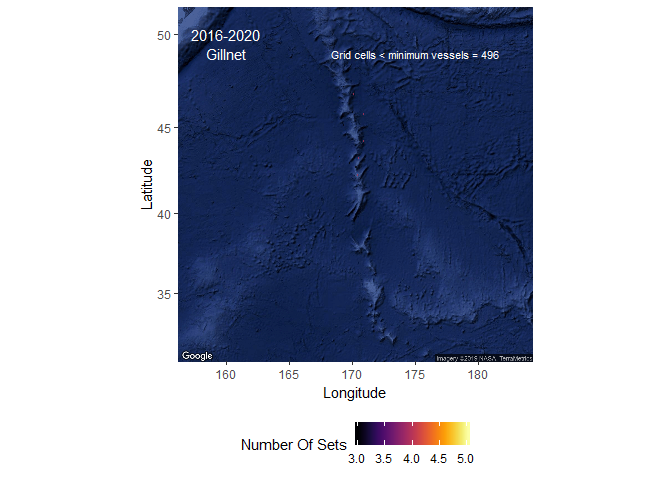
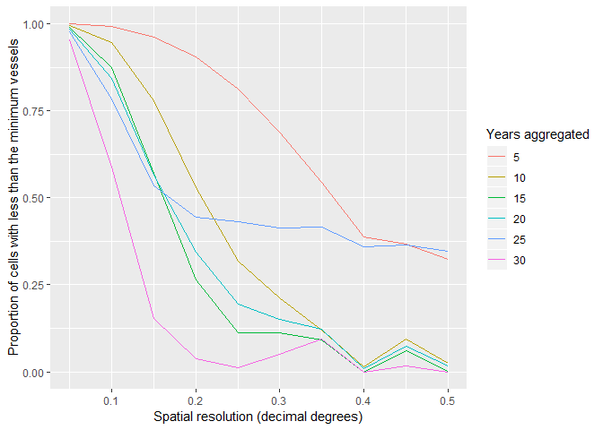

Background
==========

One of the main intersessional tasks for the SSC for Bottom Fish and
Marine Ecosystems in 2019-2020 is to come to consensus on a temporal and
spatial scale for sharing data among members. In the discussions during
the 2019 NPFC Scientific Committee meetings, a number of ideas were
proposed and then these were modified and identified as potential
options during intersessional discussions in May-July. There were four
main proposals regarding the temporal and spatial resolution for sharing
data within the NPFC:

*Option 1*: A spatial resolution of 0.5 degrees (30") longitude by 0.5
degrees (30") latitude and a temporal resolution 5 years (*preferred in
preliminary discussions*)

Option 2: A spatial resolution 5 nautical mile x 5 nautical mile (8 km x
8 km) and a temporal resolution of the entire time series (1991-present)

Option 3: A spatial resolution of 0.1 degrees longitude by 0.1 degrees
latitude and a temporal resolution of 5 years

Option 4: A geodesic hexagonal mesh with resolution level 12 or 13 of
ISEA3H grid type (described at <https://github.com/r-barnes/dggridR/>)
and a 5 year temporal resolution

In the intervening month(s), I have written a package for R that will
allow each of us to test the output maps and data from each of these
options (plus others that you would like to explore). The package can be
downloaded at <https://github.com/rooperc4/BottomFishingFootprint/> or
the code can be run from the example below. The objective of this
package is to provide tools that will help us define and map the
appropriate temporal and spatial footprint for bottom contacting fishing
gear for the NPFC convention area.

To install the package run

    #install.packages("devtools")
    devtools::install_github("rooperc4/BottomFishingFootprint")
    library(BottomFishingFootprint)

Methods
=======

The example below generates random data for the western North Pacific.
The data is the positions of sets for three gear types (longline, trap
and gillnet). The data were generated for the western North Pacific for
20 years (1991-2020) with a random number of sets (between 10 and 200)
and a random number of vessels (between 1 and 10) operating with each
gear type in each year.

    YearSet<-seq(1991,2020,1)
    GearSet<-c("Gillnet","Longline","Trap")
    W_NP<-extent(169,171,42,48)
    raster1<-raster(W_NP,resolution=.01,crs="+proj=longlat +ellps=WGS84 +datum=WGS84 +no_defs",vals=1)

    effort_data<-array(dim=c(0,5))
    colnames(effort_data)<-c("Year","Gear_type","Vessel","Longitude","Latitude")
    for(i in 1:length(YearSet)){
      for(j in 1:length(GearSet)){
          
          sets<-sample(seq(10,200,1),1)
          sample1<-sampleRandom(raster1,size=sets,xy=TRUE)
          sample1<-data.frame(Year=rep(YearSet[i],sets),Gear_type=rep(GearSet[j],sets),Vessel=rep(paste0("Vessel_",sample(seq(1,10,1),1)),sets),Longitude=sample1[,1],Latitude=sample1[,2],stringsAsFactors=FALSE)
    effort_data<-rbind(effort_data,sample1)}}

The example data looks like this (when you use your own data you can
copy this format).

    head(effort_data)

    ##   Year Gear_type   Vessel Longitude Latitude
    ## 1 1991   Gillnet Vessel_3   169.385   45.685
    ## 2 1991   Gillnet Vessel_3   169.365   46.595
    ## 3 1991   Gillnet Vessel_3   169.535   47.655
    ## 4 1991   Gillnet Vessel_3   169.675   46.415
    ## 5 1991   Gillnet Vessel_3   170.235   42.145
    ## 6 1991   Gillnet Vessel_3   169.715   44.545

Package functions
-----------------

The package has two main functions. The first is called footprint\_data.
This function takes a raw fishing effort data frame and summarizes it
for mapping, creating a footprint\_data\_object. The raw fishing effort
data should include rows for each individual fishing event (set), such
as a trawl haul or longline set. For each set the year, latitude,
longitude, gear type and a vessel identifier must be included. A minimum
number of vessels can be specified so that the output does not include
grid cells where less than this number of vessels fished a given gear
type in a given year group. The default value is 3 (consistent with
Canadian requirements for confidentiality), The starting year of
interest (usually the earliest year in the data) and how many years
should be combined should be specified. Additionally, the spatial
resolution that is required and the units of that spatial resolution
(defaults are 0.5 decimal degrees of latitude and longitude) need to be
specified. A map projection (in proj4 format) should also be given.

The function outputs a list of eight data objects that include a data
frame of raw fishing effort data (fishing\_effort\_data) summarized to
the spatial resolution provided for each fishing event with an
additional column for the year group to which the event belongs. There
should be one record in this table for each of the fishing events that
were input. This table may not be appropriate to share with the NPFC, as
it will contain records for grid cells where fewer than the minimum
number of vessels fished. The second data object output by the function
(fishing\_footprint\_table) is a table that summarizes the fishing
events by year group, latitude, longitude and gear type. This table
produces the number of sets that occurred in each year by each gear type
at a grid cell with the spatial resolution specified and the center
position given by the latitude and longitude where it was grouped. In
addition, a column specifies the number of vessels that are included at
each grid cell. The table will not include grid cells where there were
fewer than the minimum number of vessels fishing. This table may be
appropriate for sharing with the wider group, as it will meet
confidentiality rules. The third item is a table of the number of grid
cells by gear type and year group where the minimum number of vessels
was not met (not\_enough\_vessels). This table indicates how many grid
cells for which data exists, but cannot be reported. The fourth item is
the year groups identified from the inputs (years) and the fifth item is
the gear types represented in the data (gear\_types). The last three
items are the spatial resolution and units of the data summary and the
map projection of the data (map\_projection). These last items are for
tracking inputs and outputs and are needed for creating the figures
using the footprint\_map function.

The second function is called footprint\_map. This function takes the
fishing effort data object (created by the footprint\_data function) and
makes a raster map of the effort data. The outputs are a raster stack
with layers for each year group and gear type combination and a .png
figure for each year group and gear type combination. The .png object is
overlaid on a static google map of the eastern or western Pacific, based
on the input longitude values of the data. The footprint\_data\_object
must be a list including a data frame of raw fishing effort data
(fishing\_effort\_data), spatially, temporally effort data compiled by
gear type (fishing\_footprint\_table), the number of grid cells where
their are not enough vessels represented to plot the data due to
confidentiality rules (not\_enough\_vessels), gear type-year-year groups
over which the data is summarized (years), gear types over which the
data is summarized (gear\_types), the spatial resolution of the data
summary, the spatial resolution units (units) and the map projection of
the data (map\_projection). These 8 items are output from the
footprint\_data function.

Results
=======

*Option 1*: A spatial resolution of 0.5 degrees (30") longitude by 0.5 degrees (30") latitude and a temporal resolution 5 years
-------------------------------------------------------------------------------------------------------------------------------

To do option 1, run this code.

    #Specify the input spatial resolution and units
    Spatial_resolution_dd<-data.frame(Spatial_resolution=.5,Units="dd")

    #Specify the start year and the number of years to combine
    Start_year<-1991
    Years_to_combine<-5

    #What is the minimum number of vessels that need to fish a grid cell in order for the data to be shared
    Minimum_vessels<-3

    #Specify the map projection or crs in proj4 format
    map_projection_dd<-"+proj=longlat +ellps=WGS84 +datum=WGS84 +no_defs"

    #Call the function
    example_dd<-footprint_data(effort_data$Year,effort_data$Longitude,effort_data$Latitude,effort_data$Gear_type,effort_data$Vessel,Minimum_vessels,Start_year,Years_to_combine,Spatial_resolution_dd$Spatial_resolution,Spatial_resolution_dd$Units, map_projection=map_projection_dd)

    #Look at the data
    head(example_dd$fishing_effort_data)

    ##   YEAR GEAR_TYPE   VESSEL LONGITUDE LATITUDE YEAR_GROUP
    ## 1 1991   Gillnet Vessel_3     169.5     45.5  1991-1995
    ## 2 1991   Gillnet Vessel_3     169.5     46.5  1991-1995
    ## 3 1991   Gillnet Vessel_3     169.5     47.5  1991-1995
    ## 4 1991   Gillnet Vessel_3     169.5     46.5  1991-1995
    ## 5 1991   Gillnet Vessel_3       170       42  1991-1995
    ## 6 1991   Gillnet Vessel_3     169.5     44.5  1991-1995

    head(example_dd$fishing_footprint_table)

    ##        YEARS LONGITUDE LATITUDE GEAR_TYPE NumberOfSets NumberOfVessels
    ## 3  2006-2010       169       42   Gillnet            3               3
    ## 5  1991-1995     169.5       42   Gillnet            4               3
    ## 6  1996-2000     169.5       42   Gillnet           10               3
    ## 9  2011-2015     169.5       42   Gillnet            5               4
    ## 10 2016-2020     169.5       42   Gillnet            6               4
    ## 14 2006-2010       170       42   Gillnet            4               3

    example_dd$not_enough_vessels

    ##            
    ##             Gillnet Longline Trap
    ##   1991-1995      25       13   21
    ##   1996-2000      10        5    9
    ##   2001-2005      22       16   15
    ##   2006-2010      12       12   26
    ##   2011-2015       9       21   24
    ##   2016-2020       5       65   65

    example_dd$years

    ## [1] "1991-1995" "1996-2000" "2001-2005" "2006-2010" "2011-2015" "2016-2020"

    example_dd$spatial_resolution

    ## [1] 0.5

    example_dd$units

    ## [1] dd
    ## Levels: dd

    example_dd$map_projection

    ## [1] "+proj=longlat +ellps=WGS84 +datum=WGS84 +no_defs"

    #Make the maps
    rasters_dd<-footprint_map(example_dd)

    ## [1] "Not enough vessels to plot 2016-2020 Longline data"
    ## [1] "Not enough vessels to plot 2016-2020 Trap data"

Option 2: A spatial resolution 5 nautical mile x 5 nautical mile (8 km x 8 km) and a temporal resolution of the entire time series (1991-present)
-------------------------------------------------------------------------------------------------------------------------------------------------

To do option 2 run this code.

    Spatial_resolution_m<-data.frame(Spatial_resolution=8000,Units="m")

    Start_year<-1991
    Years_to_combine<-29
    Minimum_vessels<-3
    #map_projection_m<-"+proj=aea +lat_1=50 +lat_2=58.5 +lat_0=45 +lon_0=-126 +x_0=1000000 +y_0=0 +ellps=GRS80 +towgs84=0,0,0,0,0,0,0 +units=m +no_defs" #FOR EASTERN NORTH PACIFIC
    map_projection_m<-"+proj=utm +zone=59 +ellps=WGS84 +datum=WGS84 +units=m +no_defs" #FOR WESTERN NORTH PACIFIC

    example_m<-footprint_data(effort_data$Year,effort_data$Longitude,effort_data$Latitude,effort_data$Gear_type,effort_data$Vessel,Minimum_vessels,Start_year,Years_to_combine,Spatial_resolution_m$Spatial_resolution,Spatial_resolution_m$Units, map_projection=map_projection_m)

    #Look at the data
    head(example_m$fishing_effort_data)

    ##   YEAR GEAR_TYPE   VESSEL LONGITUDE LATITUDE YEAR_GROUP
    ## 1 1991   Gillnet Vessel_3    376000  5064000  1991-2019
    ## 2 1991   Gillnet Vessel_3    376000  5160000  1991-2019
    ## 3 1991   Gillnet Vessel_3    392000  5280000  1991-2019
    ## 4 1991   Gillnet Vessel_3     4e+05  5144000  1991-2019
    ## 5 1991   Gillnet Vessel_3    440000  4664000  1991-2019
    ## 6 1991   Gillnet Vessel_3     4e+05  4936000  1991-2019

    head(example_m$fishing_footprint_table)

    ##        YEARS LONGITUDE LATITUDE GEAR_TYPE NumberOfSets NumberOfVessels
    ## 9  1991-2019    352000  4656000   Gillnet            4               3
    ## 20 1991-2019    472000  4656000   Gillnet            3               3
    ## 24 1991-2019    496000  4656000   Gillnet            4               4
    ## 30 1991-2019    384000  4664000   Gillnet            4               4
    ## 31 1991-2019    392000  4664000   Gillnet            3               3
    ## 37 1991-2019    448000  4664000   Gillnet            4               3

    example_m$not_enough_vessels

    ##            
    ##             Gillnet Longline Trap
    ##   1991-2019    1028     1016 1057
    ##   2020-2019     185       71  107

    example_m$years

    ## [1] "1991-2019" "2020-2019"

    example_m$spatial_resolution

    ## [1] 8000

    example_m$units

    ## [1] m
    ## Levels: m

    example_m$map_projection

    ## [1] "+proj=utm +zone=59 +ellps=WGS84 +datum=WGS84 +units=m +no_defs"

    rasters_m<-footprint_map(example_m)

    ## [1] "Not enough vessels to plot 2020-2019 Gillnet data"
    ## [1] "Not enough vessels to plot 2020-2019 Longline data"
    ## [1] "Not enough vessels to plot 2020-2019 Trap data"

Option 3: A spatial resolution of 0.1 degrees longitude by 0.1 degrees latitude and a temporal resolution of 5 years
--------------------------------------------------------------------------------------------------------------------

To do option 3 run this code.

    Spatial_resolution_dd<-data.frame(Spatial_resolution=.1,Units="dd")

    Start_year<-1991
    Years_to_combine<-5
    Minimum_vessels<-3

    map_projection_dd<-"+proj=longlat +ellps=WGS84 +datum=WGS84 +no_defs"

    example_dd2<-footprint_data(effort_data$Year,effort_data$Longitude,effort_data$Latitude,effort_data$Gear_type,effort_data$Vessel,Minimum_vessels,Start_year,Years_to_combine,Spatial_resolution_dd$Spatial_resolution,Spatial_resolution_dd$Units, map_projection=map_projection_dd)

    #Look at the data
    head(example_dd2$fishing_effort_data)

    ##   YEAR GEAR_TYPE   VESSEL LONGITUDE LATITUDE YEAR_GROUP
    ## 1 1991   Gillnet Vessel_3     169.4     45.7  1991-1995
    ## 2 1991   Gillnet Vessel_3     169.4     46.6  1991-1995
    ## 3 1991   Gillnet Vessel_3     169.5     47.7  1991-1995
    ## 4 1991   Gillnet Vessel_3     169.7     46.4  1991-1995
    ## 5 1991   Gillnet Vessel_3     170.2     42.1  1991-1995
    ## 6 1991   Gillnet Vessel_3     169.7     44.5  1991-1995

    head(example_dd2$fishing_footprint_table)

    ##         YEARS LONGITUDE LATITUDE GEAR_TYPE NumberOfSets NumberOfVessels
    ## 126 1996-2000     169.7     42.3   Gillnet            3               3
    ## 140 2016-2020     170.4     42.3   Gillnet            4               3
    ## 159 1991-1995     169.2     42.4   Gillnet            3               3
    ## 372 2016-2020     170.3     42.8   Gillnet            3               3
    ## 423 2006-2010     170.7     42.9   Gillnet            3               3
    ## 443 2016-2020     169.8       43   Gillnet            3               3

    example_dd2$not_enough_vessels

    ##            
    ##             Gillnet Longline Trap
    ##   1991-1995     293      577  464
    ##   1996-2000     521      430  491
    ##   2001-2005     402      373  353
    ##   2006-2010     522      510  380
    ##   2011-2015     382      311  351
    ##   2016-2020     496      501  367

    example_dd2$years

    ## [1] "1991-1995" "1996-2000" "2001-2005" "2006-2010" "2011-2015" "2016-2020"

    example_dd2$spatial_resolution

    ## [1] 0.1

    example_dd2$units

    ## [1] dd
    ## Levels: dd

    example_dd2$map_projection

    ## [1] "+proj=longlat +ellps=WGS84 +datum=WGS84 +no_defs"

    rasters_dd2<-footprint_map(example_dd2)

    ## [1] "Not enough vessels to plot 2006-2010 Trap data"
    ## [1] "Not enough vessels to plot 2016-2020 Longline data"
    ## [1] "Not enough vessels to plot 2016-2020 Trap data"

Option 4: A geodesic hexagonal mesh with resolution level 12 or 13 of ISEA3H grid type (described at <https://github.com/r-barnes/dggridR/>) and a 5 year temporal resolution
-----------------------------------------------------------------------------------------------------------------------------------------------------------------------------

For Option 4, the spatial resolution is quite small. Thus a five year
temporal resolution for this example data takes a really long time (for
the actual data, it works fine). In this example I set the years to
combine to 30 years. and ran this code. Additionally, although the data
are generated on the ISEA 12 and 13 scale, I plotted them using grid
cell sizes of 0.08 and 0.05 decimal degrees respectively. This was used
for visualization only, the data in the fishing\_footprint\_object is
the actual ISEA 12 and 13 standard.

    Spatial_resolution_ISEA12<-data.frame(Spatial_resolution=NA,Units="ISEA_12")
    Spatial_resolution_ISEA13<-data.frame(Spatial_resolution=NA,Units="ISEA_13")

    Start_year<-1991
    Years_to_combine<-30
    Minimum_vessels<-3

    map_projection_dd<-"+proj=longlat +ellps=WGS84 +datum=WGS84 +no_defs"

    example_isea12<-footprint_data(effort_data$Year,effort_data$Longitude,effort_data$Latitude,effort_data$Gear_type,effort_data$Vessel,Minimum_vessels,Start_year,Years_to_combine,Spatial_resolution_ISEA12$Spatial_resolution,Spatial_resolution_ISEA12$Units, map_projection=map_projection_dd)

    #Look at the data
    head(example_isea12$fishing_effort_data)

    ##   YEAR GEAR_TYPE   VESSEL        LONGITUDE         LATITUDE YEAR_GROUP
    ## 1 1991   Gillnet Vessel_3 169.449324670773 45.6800949459887  1991-2020
    ## 2 1991   Gillnet Vessel_3 169.353636568191 46.6265837308063  1991-2020
    ## 3 1991   Gillnet Vessel_3   169.5718355634 47.6694694589243  1991-2020
    ## 4 1991   Gillnet Vessel_3 169.662771404883 46.4101174389622  1991-2020
    ## 5 1991   Gillnet Vessel_3 170.215864792701 42.1366628969995  1991-2020
    ## 6 1991   Gillnet Vessel_3 169.724586799744 44.5833069334916  1991-2020

    head(example_isea12$fishing_footprint_table)

    ##        YEARS        LONGITUDE         LATITUDE GEAR_TYPE NumberOfSets
    ## 3  1991-2020 169.394337201667 41.9952325433241   Gillnet            4
    ## 4  1991-2020 170.656449404092 42.0068426680843   Gillnet            4
    ## 6  1991-2020 170.917342668691 42.0241475760268   Gillnet            4
    ## 7  1991-2020 169.784690623682 42.0250577928312   Gillnet            3
    ## 10 1991-2020 170.175550560353 42.0536136008645   Gillnet            3
    ## 11 1991-2020 169.173139171385 42.0581093472728   Gillnet            5
    ##    NumberOfVessels
    ## 3                3
    ## 4                4
    ## 6                4
    ## 7                3
    ## 10               3
    ## 11               4

    example_isea12$not_enough_vessels

    ##            
    ##             Gillnet Longline Trap
    ##   1991-2020     540      528  638

    example_isea12$years

    ## [1] "1991-2020"

    example_isea12$spatial_resolution

    ## [1] 0.08

    example_isea12$units

    ## [1] ISEA_12
    ## Levels: ISEA_12

    example_isea12$map_projection

    ## [1] "+proj=longlat +ellps=WGS84 +datum=WGS84 +no_defs"

    rasters_isea12<-footprint_map(example_isea12)

    example_isea13<-footprint_data(effort_data$Year,effort_data$Longitude,effort_data$Latitude,effort_data$Gear_type,effort_data$Vessel,Minimum_vessels,Start_year,Years_to_combine,Spatial_resolution_ISEA13$Spatial_resolution,Spatial_resolution_ISEA13$Units, map_projection=map_projection_dd)

    head(example_isea13$fishing_effort_data)

    ##   YEAR GEAR_TYPE   VESSEL        LONGITUDE         LATITUDE YEAR_GROUP
    ## 1 1991   Gillnet Vessel_3 169.369284069924 45.7009259727062  1991-2020
    ## 2 1991   Gillnet Vessel_3 169.375197921537  46.575248438756  1991-2020
    ## 3 1991   Gillnet Vessel_3 169.510100283451 47.6389783169663  1991-2020
    ## 4 1991   Gillnet Vessel_3 169.662771404883 46.4101174389622  1991-2020
    ## 5 1991   Gillnet Vessel_3 170.215864792701 42.1366628969995  1991-2020
    ## 6 1991   Gillnet Vessel_3 169.743549608939 44.5314003487964  1991-2020

    head(example_isea13$fishing_footprint_table)

    ##        YEARS        LONGITUDE         LATITUDE GEAR_TYPE NumberOfSets
    ## 33 1991-2020  170.82807950633   42.09837568641   Gillnet            3
    ## 40 1991-2020 170.624066122123 42.1114757384291   Gillnet            3
    ## 54 1991-2020 169.676955332392 42.1507359546544   Gillnet            3
    ## 59 1991-2020 169.472688188781 42.1619265719708   Gillnet            5
    ## 71 1991-2020 169.659810368667 42.2029494496908   Gillnet            4
    ## 93 1991-2020 169.307335146927 42.2561538445489   Gillnet            3
    ##    NumberOfVessels
    ## 33               3
    ## 40               3
    ## 54               3
    ## 59               4
    ## 71               4
    ## 93               3

    example_isea13$not_enough_vessels

    ##            
    ##             Gillnet Longline Trap
    ##   1991-2020    1925     1885 1814

    example_isea13$years

    ## [1] "1991-2020"

    example_isea13$spatial_resolution

    ## [1] 0.05

    example_isea13$units

    ## [1] ISEA_13
    ## Levels: ISEA_13

    example_isea13$map_projection

    ## [1] "+proj=longlat +ellps=WGS84 +datum=WGS84 +no_defs"

    rasters_isea13<-footprint_map(example_isea13)

Conclusions
===========

For the sample data, there are a lot of grid cells with not enough
vessels for each method. Unsurprisingly, the higher resolution data is
better for identifying the spatial extent of the footprint (ISEA and 8
km grids), but either the temporal resolution suffers or a lot of grid
cells are missing.

Here's a look at the relationship between resolution and number of cells
excluded using the sample data for a number of different combinations of
spatial resolution and temporal resolution.

